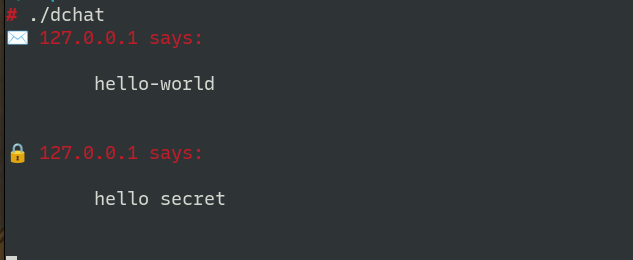

# Dominion Chat

DNS chat server for fun and profit



# Usage

```
Usage: dchat [-t <threads>] [-p <port>] [-i <ip>] [-d <domain>]

Receive DNS messages from the world

Options:
  -t, --threads     number of threads in the thread pool
  -p, --port        UDP port to listen to
  -i, --ip          ip to listen to
  -d, --domain      domain name to use as a filter
  --help            display usage information
```
